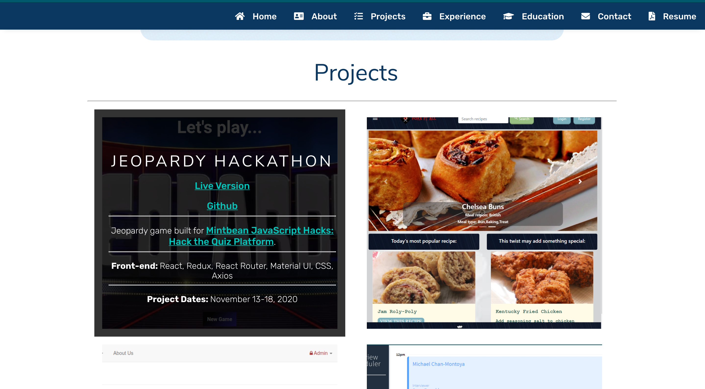

# Kelsi Proulx: Full Stack Web Developer

<b>Live version is at https://www.kelsidev.net</b>

Welcome to my personal portfolio website. This is the second version of the site in a sense, but at the same time is fully original since this is the first time I've built it with no template.
The site was built using React (Create React App) and CSS.
If you're interested the repo for my original site is here: https://github.com/kelsi2/V1_Portfolio.

### Screenshots



### Running Locally
```
1. Fork this project
2. npm install to install dependencies
3. npm start to run
```

### Dependencies
* React
* Axios
* Lodash
* Node-Sass
* React-Dom
* React-Router-Dom
